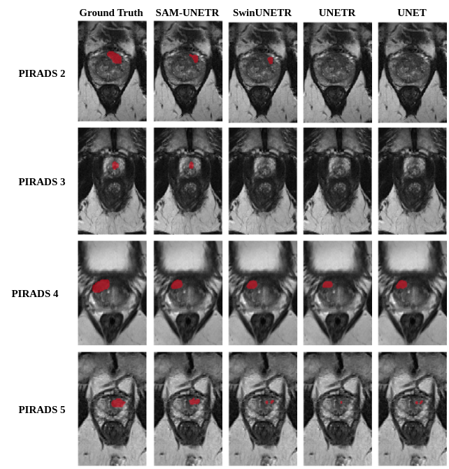
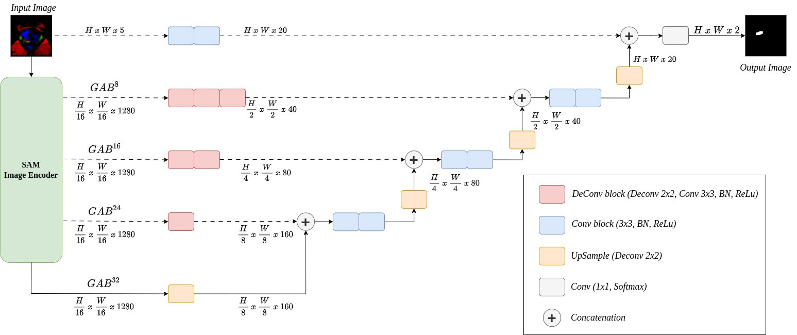
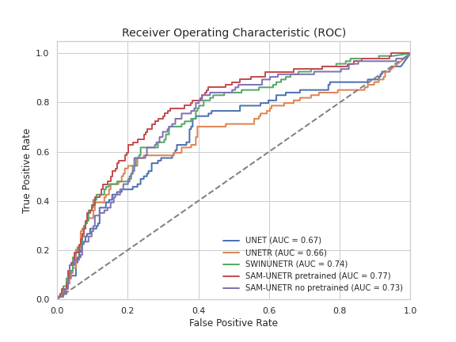

# SAM-UNETR

This repository contains the code of SAM-UNETR, a model that combines the [Segment Anything Model (SAM)](https://github.com/facebookresearch/segment-anything) image encoder from Meta AI with a convolutional-decoder based on UNETR. SAM-UNETR was specifically trained and evaluated for the challenging task of Clinically Significant Prostate Cancer Segmentation.

## Model Architecture

SAM-UNETR is designed to leverage the strengths of both SAM and UNETR to achieve accurate prostate cancer segmentation. The model incorporates the powerful image encoding capabilities of SAM with the effective convolutional-decoder structure of UNETR, resulting in improved segmentation performance.

## Dataset

To train and evaluate SAM-UNETR, a dataset of clinically significant prostate cancer images was used. The dataset consists of high-resolution MRI scans along with corresponding ground truth segmentation masks from [PI-CAI Challenge](https://github.com/facebookresearch/segment-anything) and [Prostate158](https://github.com/kbressem/prostate158).

## Results

SAM-UNETR achieved good results on the Clinically Significant Prostate Cancer Segmentation task. The model's performance was evaluated against other models apliying the same technique.

## Usage

To use SAM-UNETR first run [Extract_SAM_encoder_weigths.ipynb](Extract_SAM_encoder_weigths.ipynb) to save the weights of the image encoder, then run  requires `Train_model.py`  file that you want to use.
Finally `Analize_Results_model.py` contains the codes for predictions on each model